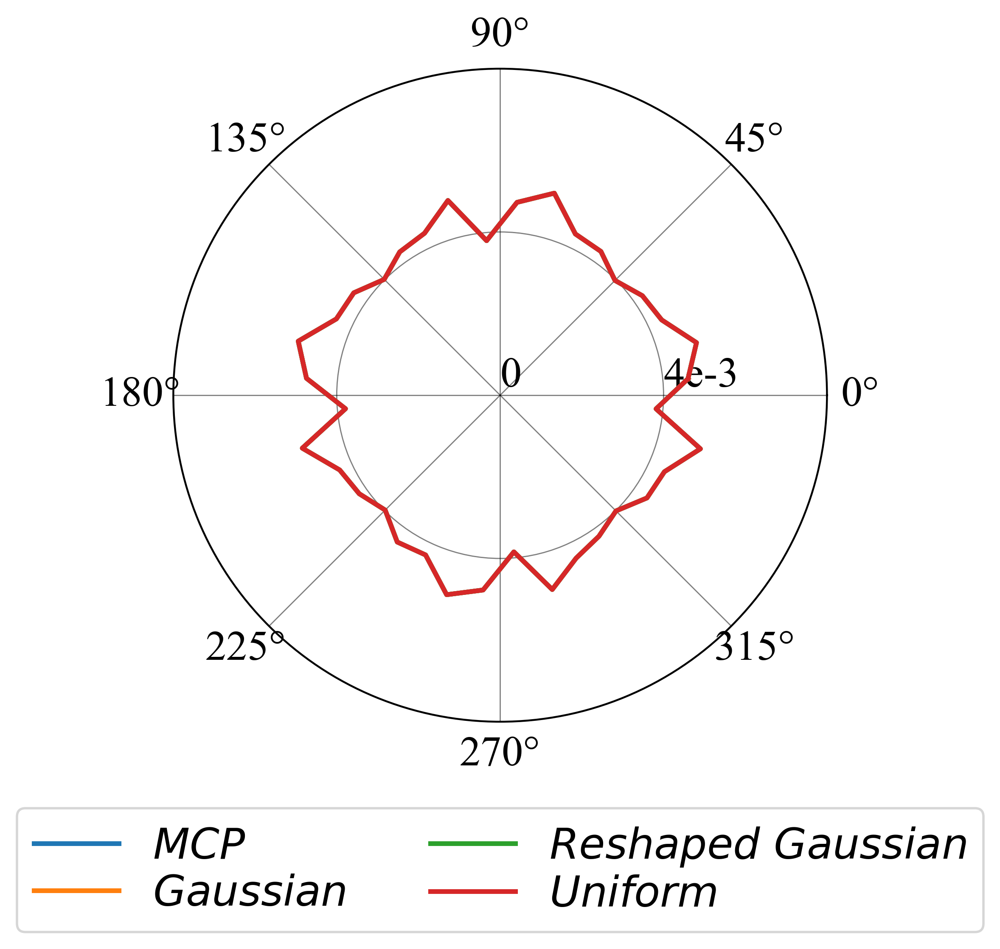
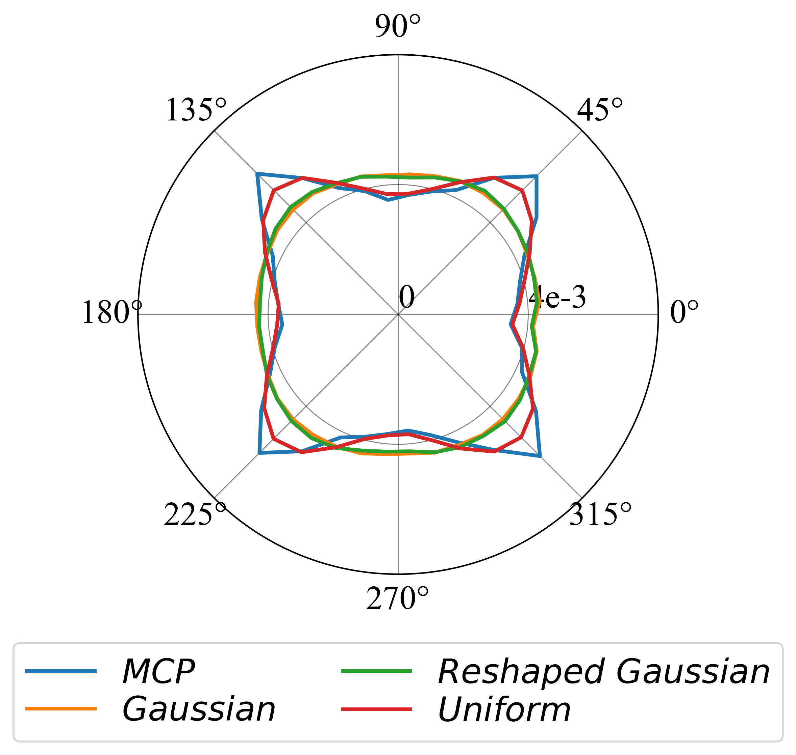
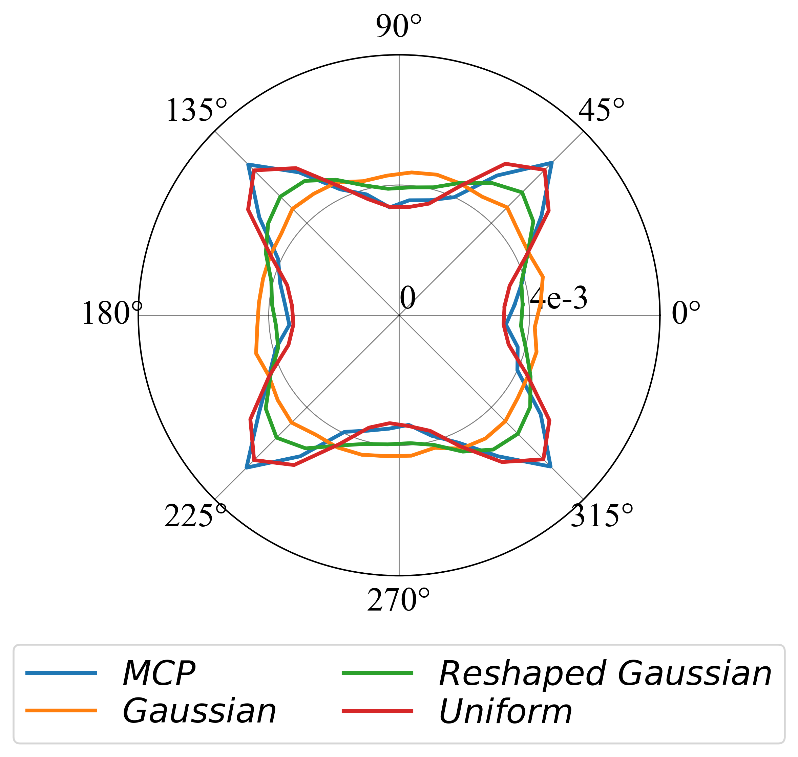
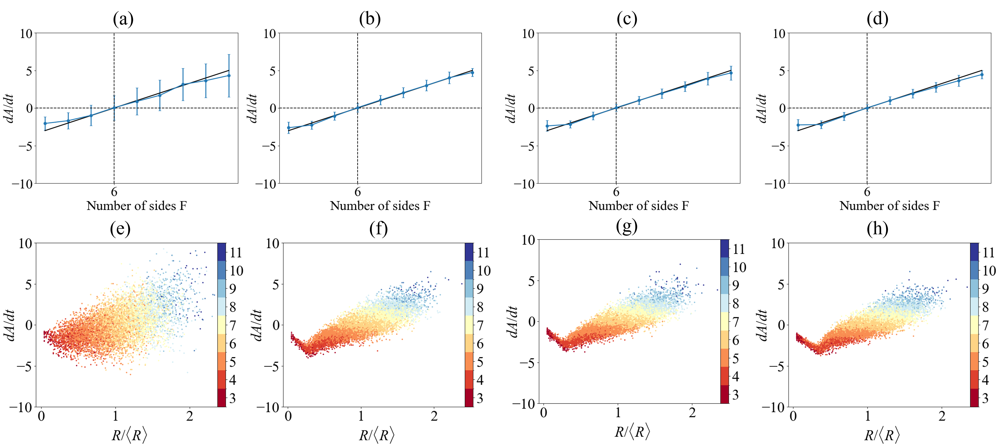

# A Mode Filter Approach to Grain Growth: Improved Performance in Lattice Pinning and von Neumann/Mullins Relations[link]()

Code for replicate paper

## Usage
1. code in mf_simulation is to create the MF simulation result
2. code in inclination_distribution and vnmr folder is to analyze and visualize the generated result

## Simulation Results

  
  
  

    <em >Gaussian sampling(left), reshaped Gaussian sampling(mid) and Uniform sampling (right).</em>

 

## Analysis Results
### Lattice pinning analysis

  
  
  
  

### von Neumann-Mullins relation analysis

  

## License
[MIT](https://choosealicense.com/licenses/mit/)

## Citation
